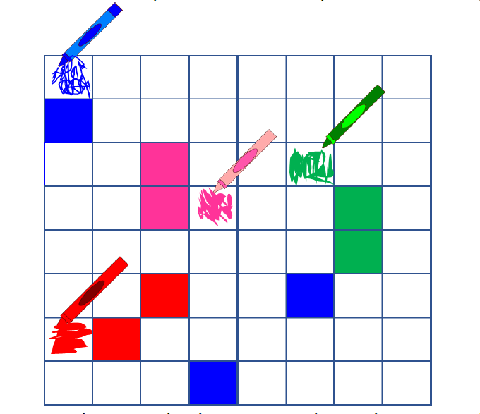

# ColourMe
ColorMe is a distributed, real-time, multiplayer game. The game is played by four players, each having a pen of a different color. Players compete to color the maximum number of cells on a configurable game board. The game ends when all boxes have been taken over, the player with the most number of boxes wins the game.

## Instructions

#### Requirements
1. Java 8
2. Gradle - (To install Gradle: https://gradle.org/install/)


#### To Run
```
1. git clone https://github.com/ArsalanMacknojia/colourMe
2. Run gradle wrapper script:
    a. Windows: gradle.bat build
    b. *nix platforms: ./gradlew build
```

## Gameplay



## Game Architecture
Game Architecture Report: docs/game-architecture.pdf
